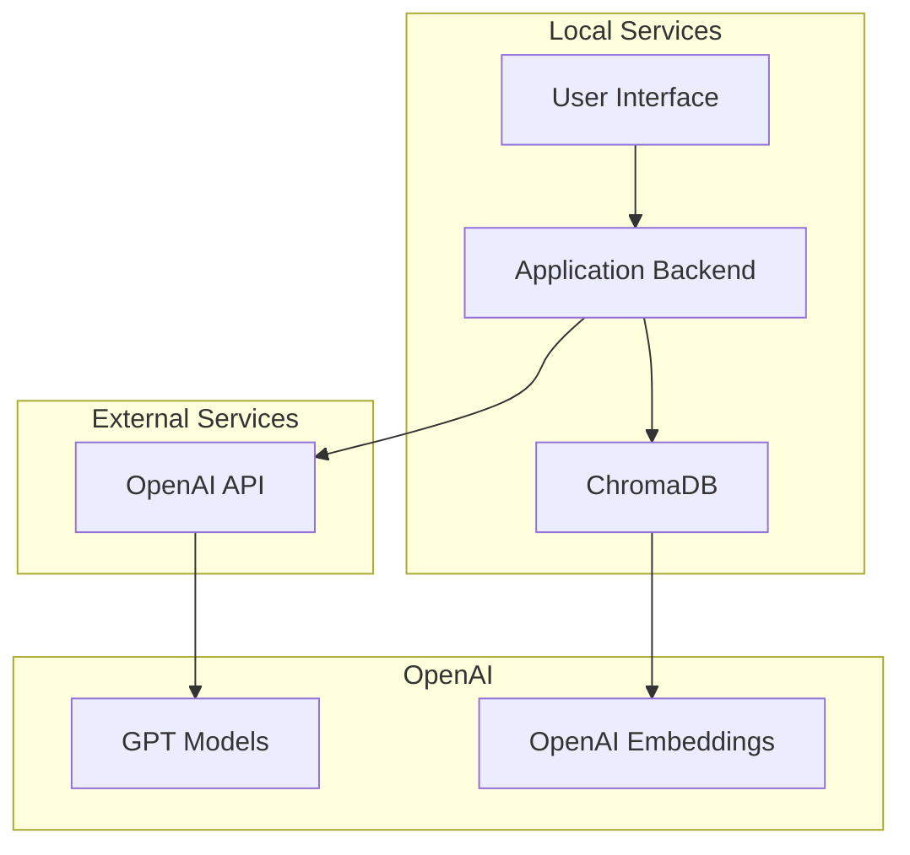
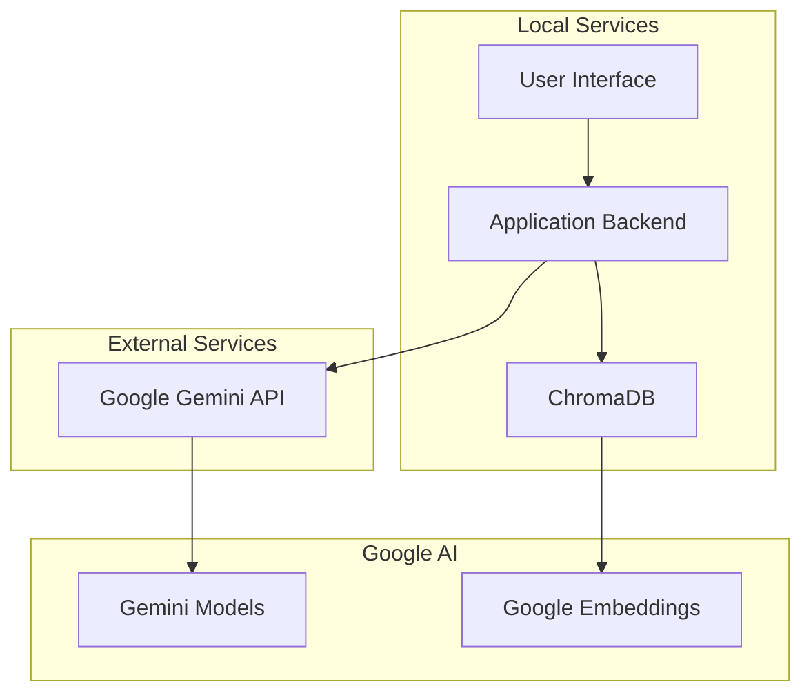

# Architecture Comparison: OpenAI vs Google Gemini

This document shows the architecture changes made when migrating from OpenAI to Google Gemini.

## Before: OpenAI Architecture

## After: Google Gemini Architecture

## Key Changes

1. **API Provider**: Changed from OpenAI to Google Gemini
2. **Models**: 
   - Chat models: `gpt-4`/`gpt-3.5-turbo` → `gemini-pro`
   - Embedding models: `text-embedding-3-large` → `models/embedding-001`
3. **Libraries**: 
   - `openai` → `google-generativeai`
   - `langchain-openai` → `langchain-google-genai`
4. **Environment Variables**: 
   - `OPENAI_API_KEY` → `GOOGLE_GEMINI_API_KEY`

## Benefits of Migration

1. **Cost**: Google Gemini may offer more competitive pricing
2. **Integration**: Better integration with other Google services
3. **Performance**: Gemini models may provide better performance for certain tasks
4. **Features**: Access to Google's latest AI innovations